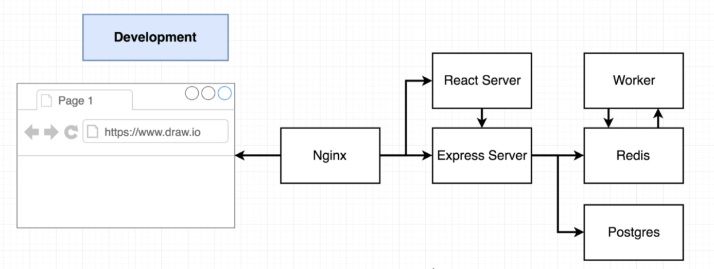

<!-- @format -->

# Multi Docker conatiners

1.  What i did here?
2.  let's understand the application architecture?

# What i did here?

first I create a frontend Dockerfile then I create a backend docker file and the backend need database I used Postgress and Redis that is cache to store frequently accessed data in memory

# let's understand the application architecture?

## frontend architecture

